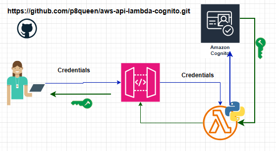
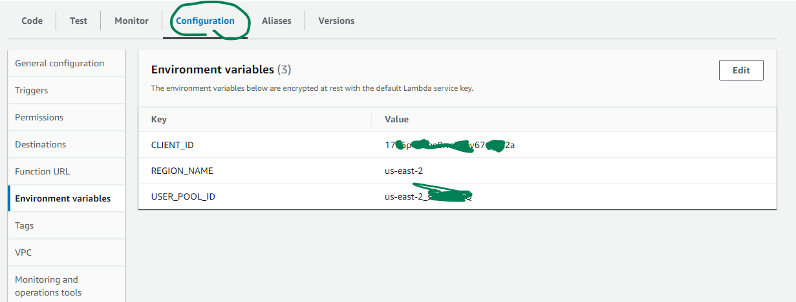
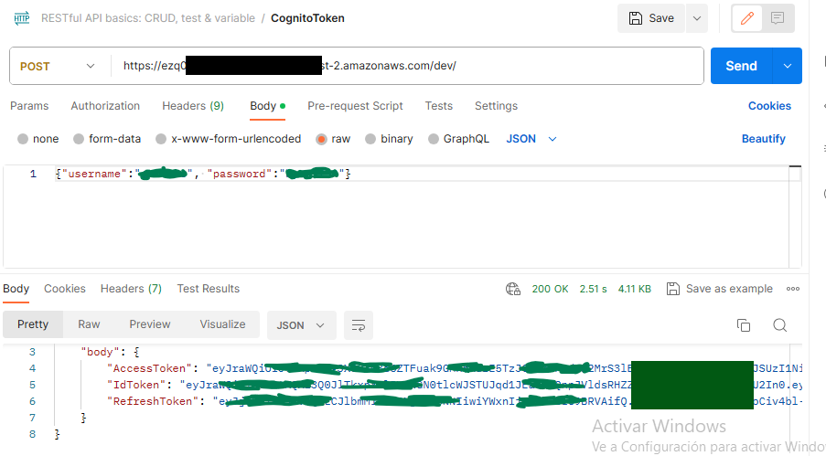

## Notes

The Users pool have username, email, password for each user. You want send username, password and get Token.   

    

**First:**   
Amazon Cognito -> Users pool - > User pool name -> App Integration -> app client Name 
-> show details/Edit -> Authentication flows -> Allow user-password-auth flow for app-based authentication (USER_PASSWORD_AUTH).

**Second:**   
LambaFunction.py and main.py have almost the same code. Find Lambda Environment variables !!     

   

**Third:**  
Write local Python Code as in main.py

Four:   
You can use PostMan as is shown in the Image Below to test the API and Lambda Function 

   

